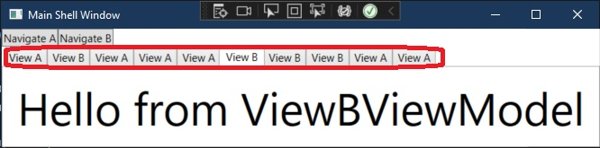

# Basic example of Tab Control. 
- How to add view to a tab in a tab control.
- One approach is to use View discovery. This is not the right approach for at least two reasons. 
- This example demonistrats the use of View discovery to add views to tabs.
- The first problem is as you can see below, there is if else conditions for adding views to tab. THis is not ideal.

```cs
void Navigate(string navigationPath)
{
    if(navigationPath == "ViewA")
        _regionManager.RegisterViewWithRegion("TabRegion", typeof(ViewA));
    if (navigationPath == "ViewB")
        _regionManager.RegisterViewWithRegion("TabRegion", typeof(ViewB));
}
```

- The second problem is if I try to add an existing view which is already added to the tab control, we expect that the existing tab is shown up and the the same view is not added to the tab control by adding one more tab. This is not the case. 



- The followiong are the steps
- Make the tab control a region
```xml
<TabControl Grid.Row="1" prism:RegionManager.RegionName="TabRegion" />
```

- In the ModuelAModule class, register ViewA with tab region. So by this when the app is launched there will be a default tab with View A in it.

```cs
public void OnInitialized(IContainerProvider containerProvider)
{
    // The OnInitialized method will guarantee that the shell has been loaded and that the region has been created at this point
    _regionManager.RegisterViewWithRegion("TabRegion", typeof(ViewA));
}
```

- The tab header is added by setting a style as follows.

```xml
<Window.Resources>
    <Style TargetType="TabItem">
        <Setter Property="Header" Value="{Binding DataContext.Title}" />
    </Style>
</Window.Resources>
```

- All the view models are derived from ViewModelBase which has a Title property. 

