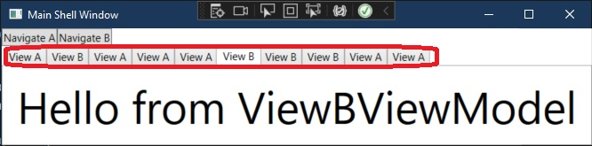

# Basic example of Tab Control. 
- How to add view to a tab in a tab control.
- The second approach is to use View Injection. This is again not the right approach for at least two reasons. And they are the same resion we discussed before with View discovery 
- This example demonistrats the use of View discovery to add views to tabs.
- The first problem is as you can see below, there is if else conditions for adding views to tab. THis is not ideal.

```cs
void Navigate(string navigationPath)
{
    var region = _regionManager.Regions["TabRegion"];
    if (navigationPath == "ViewA")
    {
        var view = _container.Resolve<ViewA>();
        region.Add(view);
    }
    if (navigationPath == "ViewB")
    {
        var view = _container.Resolve<ViewB>();
        region.Add(view);
    }
}
```

- The second problem is if I try to add an existing view which is already added to the tab control, we expect that the existing tab is shown up and the the same view is not added to the tab control by adding one more tab. This is not the case. 



