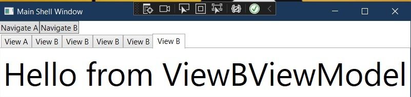

# Basic example of Tab Control. 
- Here we are controlling the instances of the views added to the tab. 
- We have to impliment INavigationAware interface to the view models. Fir this example, we will be implimenting that to the base class ViewModelBase, and override as necessary. Note that the methods we want to over ride must be marked virtual in the base class. For example we mark IsNavigationTarget as virtual.
- For ViewAViewModel, we will override this and return true, and for ViewBViewModel, we will return false.

```cs
public virtual bool IsNavigationTarget(NavigationContext navigationContext)
{
    return true;
}
public void OnNavigatedFrom(NavigationContext navigationContext)
{
}
public void OnNavigatedTo(NavigationContext navigationContext)
{
}
```


- Now run the app and observe. 
- No matter how many times you click the button Navigate A, a tab will be opened only once and that tab will be activated.
- But Navigate B will be opened many times.



- For passing parameters take a [look at this exmaple](https://github.com/AvtsVivek/LearnWpfPrism/tree/main/src/apps/200700-NavigationParmsStart), the notes for the above [is here](https://github.com/AvtsVivek/LearnWpfPrism/tree/main/src/tasks/200700-NavigationParmsStart).

