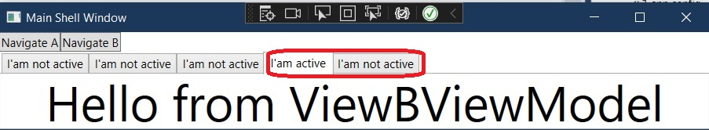

# Basic example of Tab Control. 
- How to know if a tab is active?
- Impliment IActiveAware interface. 
- So for this example, impliment that interface on the ViewModelBase class as follows.

```cs
private bool _isActive;
public bool IsActive
{
    get { return _isActive; }
    set { 
        SetProperty(ref _isActive, value);
        if (IsActive)
        {
            Title = "I'am active";
        }
        else
        {
            Title = "I'am not active";
        }
    }
}
public event EventHandler? IsActiveChanged;
```


- Now run the app and observe. The tab titles will be different this time



